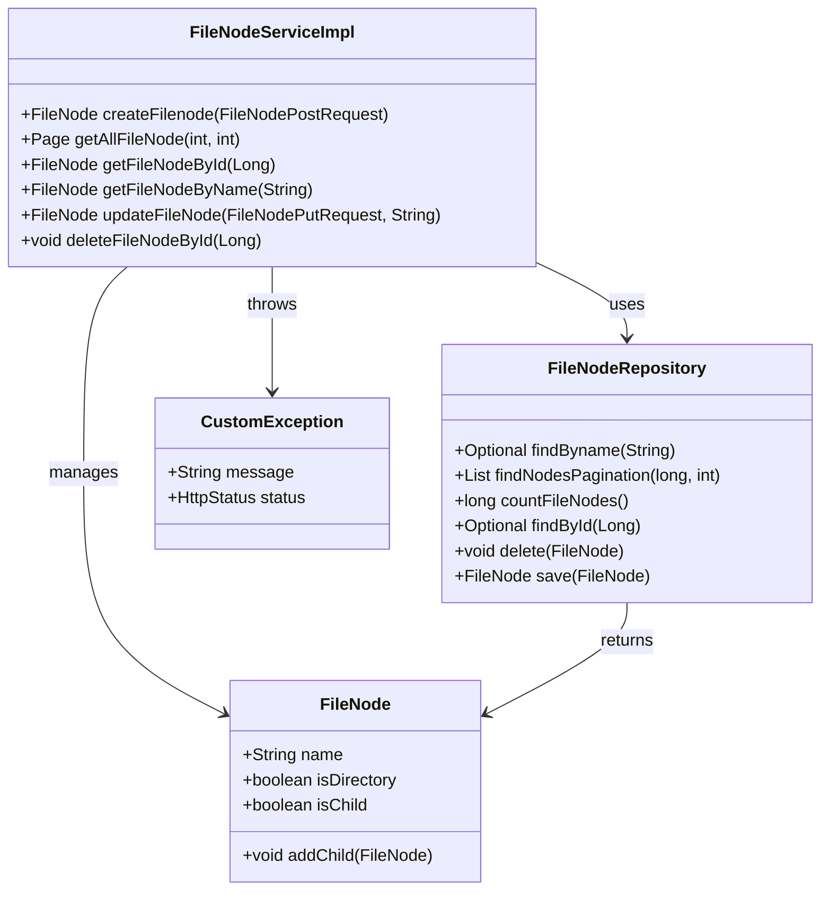

# Sistema de Gerenciamento de Arquivos

**Desenvolvedor:** João Vitor de Lima  
**Cargo:** Desenvolvedor Fullstack Pleno

Bem-vindo ao **Sistema de Gerenciamento de Arquivos**, uma solução robusta e escalável para gerenciar arquivos e diretórios de forma eficiente. Este projeto combina uma API Restful com um frontend completo, integrando autenticação segura via JWT e validações robustas. Com uma arquitetura baseada em grafos utilizando Neo4j, o sistema é capaz de modelar hierarquias complexas de arquivos e diretórios, garantindo desempenho e integridade dos dados.

---

## 🚀 Principais Tecnologias

- **Java 17**  
- **Spring Boot 3**  
- **Spring Data JPA**  
- **Spring Data Neo4j**  
- **OpenAPI (Swagger)**  
- **H2 Database**
- **React js**    

---

## 🚨 Aviso

Certifique-se de que as seguintes portas estão disponíveis:  
- **8080** (Backend)  
- **3000** (Frontend)  
- **7687** (Neo4j Bolt)  
- **7474** (Neo4j Browser)  

---

🌐 Acesso aos Serviços

 - Swagger UI: http://localhost:8080/swagger-ui/index.html

 - Neo4j Browser: http://localhost:7474/browser/

 - Frontend: http://localhost:3000

---

## 📊 Diagrama de Classes (Domínio da API)


---

## API Endpoints
-------------

| Método | Endpoint                                   | Descrição                                   |
|--------|--------------------------------------------|---------------------------------------------|
| POST   | `/api/filesystem/create`                     | Cria um novo arquivo ou diretório           |
| GET    | `/api/filesystem/?page={page}&size={size}`   | Recupera uma lista paginada de file nodes   |
| GET    | `api/filesystem/?id={id}`                    | Obtém um arquivo ou diretório pelo ID       |
| GET    | `/api/filesystem/?name={name}`               | Obtém um arquivo ou diretório pelo nome     |
| PUT    | `/api/filesystem/update?name={name}'`        | Atualiza um arquivo ou diretório existente  |
| DELETE | `/api/filesystem/delete?id={id}`             | Deleta um arquivo ou diretório pelo ID      |
| POST   | `/api/auth/login`                            | Autentica um usuário                        |


---

🗂️ Modelagem de Dados com Neo4j

O Neo4j foi escolhido por sua capacidade de modelar relacionamentos complexos de forma eficiente. A estrutura de arquivos e diretórios é representada como um grafo, onde os relacionamentos CONTAINS definem a hierarquia. Por exemplo:

    ROOT contém VAR

    VAR contém WWW

    WWW contém INDEX.HTML

Exemplo de Estrutura no Neo4j


---

## 🛠️  Como utilizar

```bash
    git clone https://github.com/JoaolimaDev/Sistema-de-Gerenciamento.git
    cd spring-app
    mvn clean package
    sudo docker-compose up --build
```

🚨 **Aviso:** Foi implementada autenticação JWT, utilizando Spring Security. Dois usuários estão disponíveis, além de testes unitários na camada de service e de integração na camada de controller.

1. **Usuário Admin**
   - **Nome de Usuário:** admin
   - **Senha:** admin123

2. **Usuário Comum**
   - **Nome de Usuário:** user
   - **Senha:** user123

📌 Próximos Passos

   - Implementação de RBAC (Role-Based Access Control) para controle de acesso baseado em papéis.

   - Expansão dos testes unitários e de integração.

<p align="left">
  📞  Contatos: ⤵️
</p>

<p align="left">
  <a href="mailto:ozymandiasphp@gmail.com" title="Gmail">
  </a>
  <a href="https://www.linkedin.com/in/jo%C3%A3o-vitor-de-lima-dev/" title="LinkedIn">
  </a>
  <a href="https://wa.me/5581989553431" title="WhatsApp">
  </a>
</p>


   
