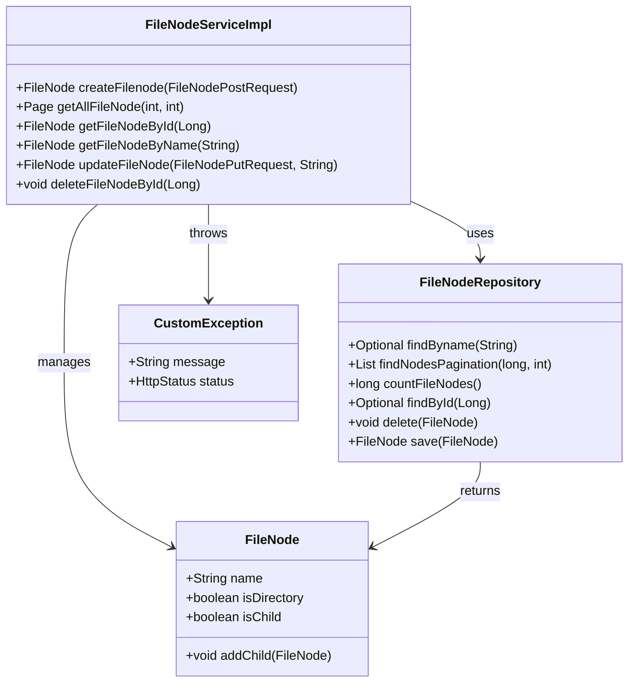

## Desafio Essia, sistema de gerenciamento de arquivos -- Dev João vitor de lima Desenvolvedor Fullstark Pleno

Restful api, com frontend completo, autênticação e validação via JWT token

## Principais Tecnologias

- **Java 17**: java version 17.0.6-tem
- **Spring Boot 3**: 3.3.4
- **Spring Data JPA**: versão mais recente
- **Spring Data Neo4j**: versão mais recente
 - **OpenAPI (Swagger)**: 2.6.0

## Diagrama de Classes (Domínio da API)

## API Endpoints
-------------

| Método | Endpoint                                   | Descrição                                   |
|--------|--------------------------------------------|---------------------------------------------|
| POST   | `/api/filesystem/create`                     | Cria um novo arquivo ou diretório           |
| GET    | `/api/filesystem/?page={page}&size={size}`   | Recupera uma lista paginada de file nodes   |
| GET    | `api/filesystem/{id}`                        | Obtém um arquivo ou diretório pelo ID       |
| GET    | `/api/filesystem/{name}`                     | Obtém um arquivo ou diretório pelo nome     |
| PUT    | `/api/filesystem/update?name={name}'`        | Atualiza um arquivo ou diretório existente  |
| DELETE | `/api/filesystem/delete?id={id}`             | Deleta um arquivo ou diretório pelo ID      |
| POST   | `/api/auth/login`                            | Autentica um usuário                        |
