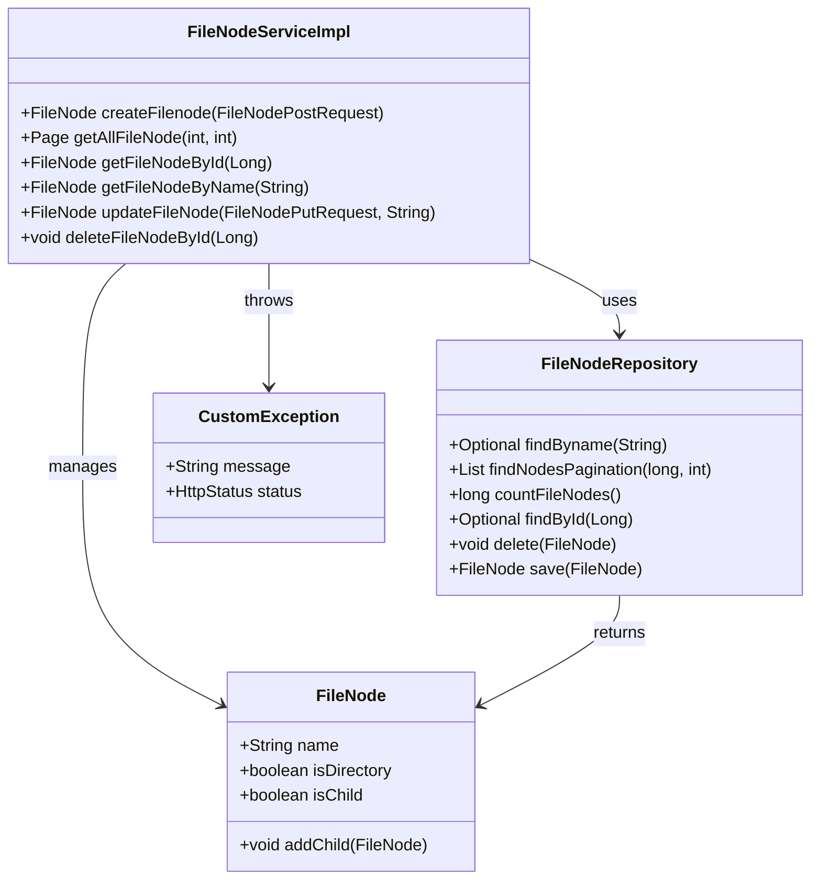
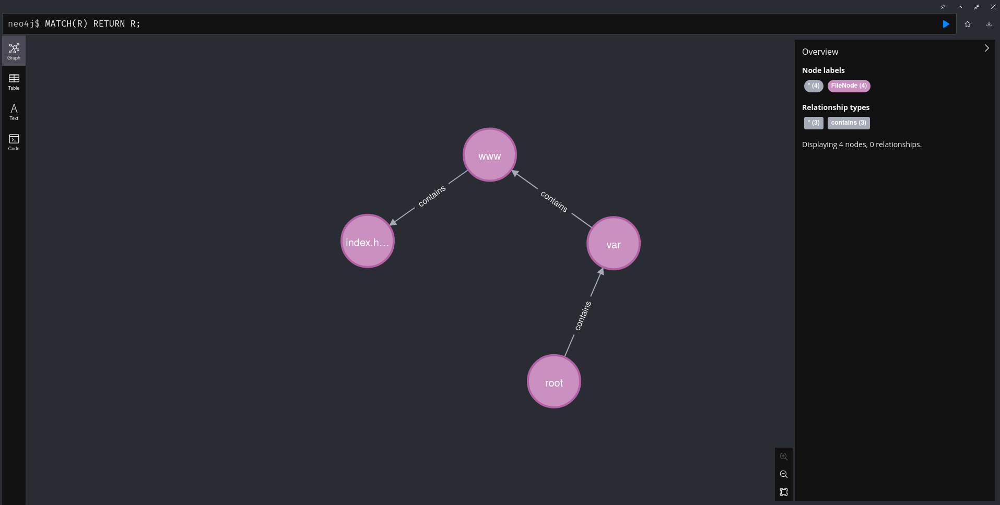

## Desafio Essia: Sistema de Gerenciamento de Arquivos

**Dev:** João Vitor de Lima  
**Desenvolvedor Fullstack Pleno**

Restful API com frontend completo, autenticação e validação via JWT token.

## Principais Tecnologias

- **Java 17:** versão 17.0.6-tem
- **Spring Boot 3:** 3.3.4
- **Spring Data JPA:** versão mais recente
- **Spring Data Neo4j:** versão mais recente
- **OpenAPI (Swagger):** 2.6.0
- **H2:** versão mais recente

## Diagrama de Classes (Domínio da API)



## API Endpoints
-------------

| Método | Endpoint                                   | Descrição                                   |
|--------|--------------------------------------------|---------------------------------------------|
| POST   | `/api/filesystem/create`                     | Cria um novo arquivo ou diretório           |
| GET    | `/api/filesystem/?page={page}&size={size}`   | Recupera uma lista paginada de file nodes   |
| GET    | `api/filesystem/?id={id}`                    | Obtém um arquivo ou diretório pelo ID       |
| GET    | `/api/filesystem/?name={name}`               | Obtém um arquivo ou diretório pelo nome     |
| PUT    | `/api/filesystem/update?name={name}'`        | Atualiza um arquivo ou diretório existente  |
| DELETE | `/api/filesystem/delete?id={id}`             | Deleta um arquivo ou diretório pelo ID      |
| POST   | `/api/auth/login`                            | Autentica um usuário                        |

## Diagrama cypher no NEO4J, exemplo de uma estrutura unix like, da pasta VAR -> WWW -> INDEX.HTML, AONDE OS RELACIONAMENTOS SÃO MARCADOS POR CONTAINS, SENDO QUE ROOT CONTAINS VAR, VAR CONTAINS WWW E WWW CONTAINS INDEX.HTML


O uso do Neo4j em um sistema de gerenciamento de arquivos é justificado por sua capacidade de modelar relacionamentos complexos de forma eficiente. Arquivos e diretórios, que possuem hierarquias naturais, são facilmente representados como grafos, permitindo consultas rápidas sobre a estrutura do sistema.

Neo4j garante a integridade dos dados por meio de transações em operações de criação, atualização e exclusão.
A escalabilidade do Neo4j é um fator importante, permitindo que o sistema cresça em volume e complexidade sem perda de desempenho.

## Como utilizar

```bash
    git clone https://github.com/JoaolimaDev/desafio-essia.git
    cd desafio-essia
    cd desafio-essia
    mvn clean package
    cd ..
    sudo docker-compose up --build
```

🚨 **Aviso:** Foi implementada autenticação JWT, utilizando Spring Security. Dois usuários estão disponíveis, além de testes unitários na camada de service e de integração na camada de controller.

1. **Usuário Admin**
   - **Nome de Usuário:** admin
   - **Senha:** admin123

2. **Usuário Comum**
   - **Nome de Usuário:** user
   - **Senha:** user123


1. **SWAGGER DISPONÍVEL**
   - **URL:** http://localhost:8080/swagger-ui/index.html

2. **ACESSO AO CONSOLE DO BANCO NEO4J**
   - **URL:** http://localhost:7474/browser/

A ideia era implementar o conceito de RBAC (role-based access control), que ficará para uma próxima atualização do projeto.

<p align="left">
  💌 Contatos: ⤵️
</p>

<p align="left">
  <a href="mailto:ozymandiasphp@gmail.com" title="Gmail">
  </a>
  <a href="https://www.linkedin.com/in/jo%C3%A3o-vitor-de-lima-74441b1b1/" title="LinkedIn">
  </a>
  <a href="https://wa.me/5581989553431" title="WhatsApp">
  </a>
</p>


   